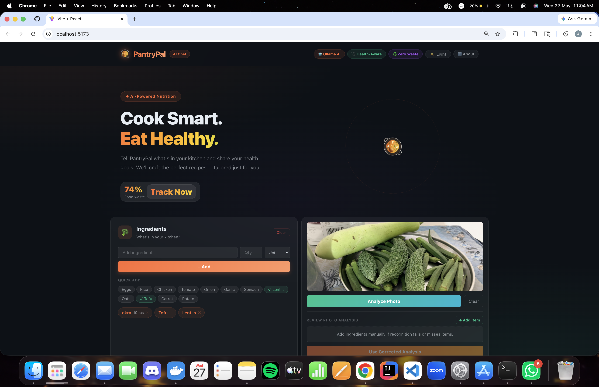
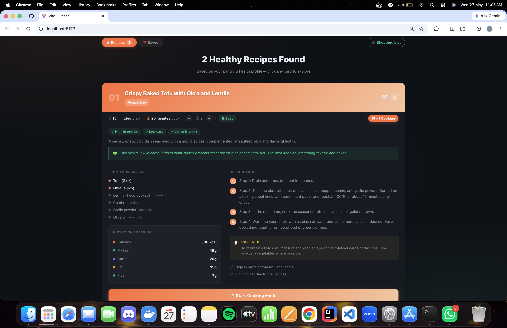
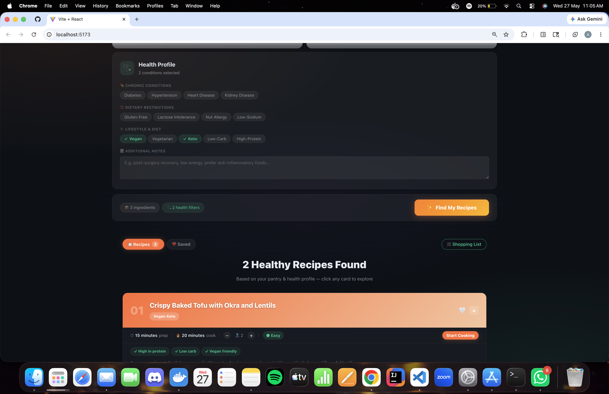
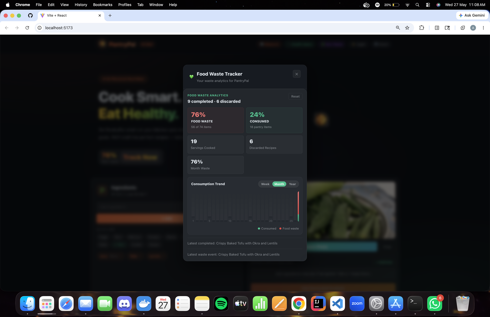
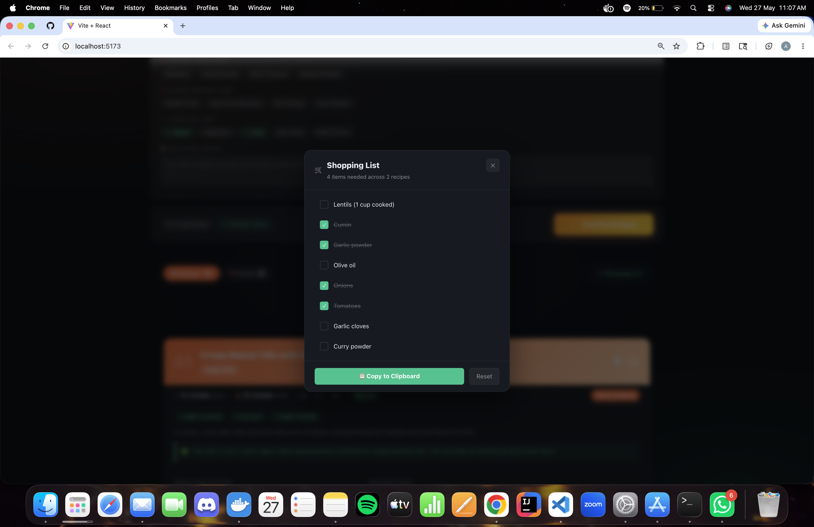
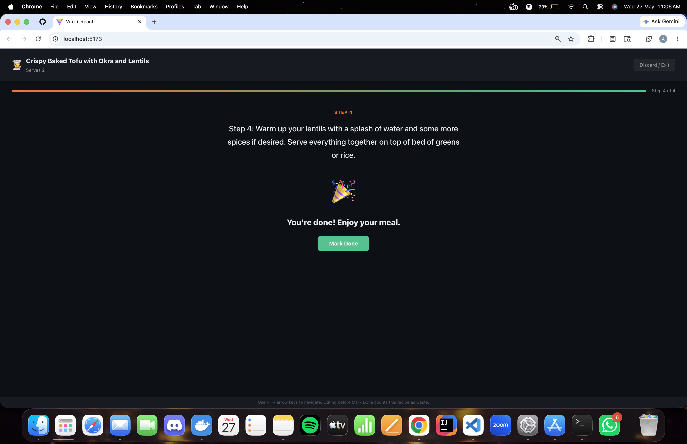

# PantryPal

Turn pantry ingredients and food photos into healthy recipe ideas, nutrition guidance, cooking mode, and food-waste insights.

PantryPal is a full-stack AI web app powered by local Ollama models. Users can type ingredients, upload a pantry or plate photo, correct the image analysis, generate personalized recipes, cook step-by-step, and track consumption vs food waste over time.

## Features

- Ingredient input with quick-add chips, quantities, and units.
- Food photo upload with Ollama vision recognition.
- Editable photo-analysis review so users can correct, remove, or add detected ingredients before regenerating recipes.
- Health profile filters for chronic conditions, dietary needs, lifestyle preferences, and notes.
- AI recipe recommendations with instructions, health tags, nutrition estimates, and tips.
- Cooking Mode for every recipe, including serving adjustment and step navigation.
- Food waste analytics:
  - Completed recipes count as consumed.
  - Recipes exited before `Mark Done` count as discarded waste.
  - Weekly, monthly, and yearly consumption/waste charts.
  - Numeric food waste and consumed percentages.
- Saved recipes and shopping-list helper.

## Screenshots













## Quick Start

### 1. Start Ollama

Install Ollama, then pull a recipe model and a vision model:

```bash
ollama pull phi3:mini
ollama pull llava:7b
ollama serve
```

If `llava:7b` crashes on your machine, try a smaller vision model:

```bash
ollama pull moondream
export OLLAMA_VISION_MODEL=moondream
```

### 2. Backend

```bash
cd backend
pip install -r requirements.txt
export OLLAMA_MODEL="phi3:mini"
export OLLAMA_VISION_MODEL="llava:7b"
uvicorn main:app --reload --host 127.0.0.1 --port 8000
```

The backend compresses uploaded images with Pillow before sending them to Ollama vision to reduce model-runner crashes.

### 3. Frontend

```bash
cd frontend
npm install
npm run dev
```

| Service | URL |
|---|---|
| App | http://localhost:5173 |
| API | http://localhost:8000 |
| API Docs | http://localhost:8000/docs |

## Docker

```bash
docker compose up --build
```

The compose file points the backend at the host Ollama server via `host.docker.internal`.

## API

| Method | Endpoint | Description |
|---|---|---|
| `GET` | `/health` | Health check |
| `POST` | `/api/recommend` | Generate recipes from typed/corrected ingredients |
| `POST` | `/api/recommend/image` | Analyze an uploaded image, return detected ingredients, image-analysis metadata, and recipes |

## Image Recognition Flow

1. Upload a pantry, fridge, or plate photo.
2. Ollama vision returns ingredient drafts with estimated quantity, unit, confidence, category, and notes.
3. Review and correct the analysis in the UI.
4. Click `Use Corrected Analysis` to regenerate recipes from the corrected ingredients.

Vision models are imperfect, so the correction step is part of the intended workflow.

## Food Waste Tracking

Food waste analytics are stored in browser `localStorage`.

- Tapping `Mark Done` in Cooking Mode records the recipe as consumed.
- Tapping `Discard / Exit` or pressing `Escape` before completion records the recipe as waste.
- The tracker shows consumed items, discarded recipes, waste percentages, and week/month/year charts.

Waste values are estimates based on pantry items and recipe ingredient usage, not exact gram-level measurements.

## Health Conditions Supported

`Diabetes` `Hypertension` `Heart Disease` `Kidney Disease`
`Gluten-Free` `Lactose Intolerance` `Nut Allergy` `Low-Sodium`
`Vegan` `Vegetarian` `Keto` `Low-Carb` `High-Protein` plus free-text notes.

## Project Structure

```text
pantrypal/
├── backend/
│   ├── main.py              # FastAPI routes
│   ├── bedrock.py           # Ollama recipe + vision integration
│   ├── models.py            # Pydantic schemas
│   ├── requirements.txt
│   └── tests/
├── frontend/
│   ├── src/
│   │   ├── App.jsx
│   │   ├── components/
│   │   │   ├── CookingMode.jsx
│   │   │   ├── HealthPanel.jsx
│   │   │   ├── ImageUploadPanel.jsx
│   │   │   ├── IngredientPanel.jsx
│   │   │   ├── RecipeCard.jsx
│   │   │   ├── ShoppingList.jsx
│   │   │   └── WasteTracker.jsx
│   │   └── services/api.js
│   └── package.json
└── docker-compose.yaml
```

## Troubleshooting

### Ollama vision error: model runner stopped

This usually means the selected vision model is too large for available RAM/VRAM. Try:

```bash
ollama pull moondream
export OLLAMA_VISION_MODEL=moondream
```

Then restart the backend.

### Image upload form errors

Make sure backend dependencies are installed:

```bash
pip install -r backend/requirements.txt
```

This includes `python-multipart` for uploads and `pillow` for image compression.

### API cannot reach Ollama

For local backend runs, the default Ollama URL is:

```bash
http://127.0.0.1:11434
```

For Docker, `docker-compose.yaml` sets:

```bash
OLLAMA_URL=http://host.docker.internal:11434
```

## Built With

- React 18 + Vite
- FastAPI + Pydantic
- Ollama recipe model, default `phi3:mini`
- Ollama vision model, default `llava:7b`
- Pillow image compression

*Built by Team PantryPal.*
